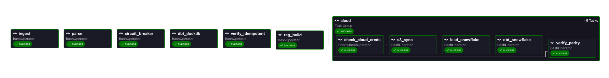

# Trial & Safety Signal Assistant

A data + GenAI pipeline over public clinical trial data (atopic
dermatitis) from ClinicalTrials.gov. dbt models run on a dual warehouse
— DuckDB locally and in CI, Snowflake as the cloud demo — dbt snapshots
track trial status changes over time, and a RAG layer answers
natural-language questions ("why was this trial withdrawn?") with cited
Claude answers. The design rule throughout: AI sits at the edges,
everything in the middle is deterministic SQL/Python, and the LLM only
writes prose over retrieved context — it never generates facts.

## Architecture

```
ClinicalTrials.gov API v2
        │  (ingest/fetch_clinical_trials.py — tested parser)
        ▼
data/raw JSON ──► parser bridge ──► data/parsed parquet (ingest_date partitions)
        │
        ├──► DuckDB (local dev + CI target — reads the parquet directly)
        └──► aws s3 sync ──► S3 parsed/ landing [Terraform, eu-west-3]
                                   └──► COPY INTO Snowflake RAW.TRIALS
                                        (external stage; demo target)
        │
        ▼
dbt: staging ──► snapshots (SCD2 on overall_status; both targets) ──► marts
        │
        ▼
Embeddings (sentence-transformers, per-field docs) ──► Chroma (+ metadata)
        │
        ▼
RAG retrieval ──► Claude API ──► grounded answer with NCT citations
```

Control plane: Airflow DAG (Astro, daily) · GitHub Actions CI · Terraform.



*One daily run, end to end: ingest → parse → circuit breaker → local
dbt (live snapshot + build) → RAG reindex, then S3 sync → Snowflake
load → Snowflake build → cross-target parity check. Local runs before
cloud so an AWS or Snowflake outage can never cost a snapshot day.*

## Ask it a question

```
$ make ask Q="Why was the tezepelumab monotherapy trial in atopic dermatitis stopped?"
{
  "answer": "The tezepelumab monotherapy trial in atopic dermatitis was
             stopped because tezepelumab as a monotherapy in atopic
             dermatitis did not reach the targeted efficacy level
             pre-established for this patient population [NCT03809663].",
  "cited_nct_ids": ["NCT03809663"],
  "unverified_nct_ids": [],
  "retrieved_ids": [
    "NCT03809663:why_stopped",
    "NCT03809663:brief_summary",
    "NCT00757042:brief_summary",
    "NCT06174493:brief_summary",
    "NCT02347176:brief_summary"
  ],
  "model": "claude-sonnet-4-5-20250929"
}
```

Scored against a 10-question golden set (`make eval`):

```
question                           retrieval  citation
q01_tezepelumab_why_stopped        PASS       PASS
q02_lack_of_efficacy_interim       PASS       PASS
q03_slow_enrollment                PASS       PASS
q04_safety_reasons                 PASS       PASS
q05_crisaborole_business           PASS       PASS
q06_barzolvolimab_lookup           PASS       PASS
q07_lebrikizumab_lookup            PASS       PASS
q08_phase2_futility_filtered       PASS       PASS
q09_withdrawn_business_filtered    PASS       PASS
q10_refusal_budget                 n/a        PASS

retrieval hit-rate: 1.00 over 9 questions (threshold 0.8; refusal question excluded)
citation correctness: 1.00 over 10 questions (threshold 0.7)
```

Citations are verified, not trusted: `cited_nct_ids` is the
intersection of what the model cited with what retrieval actually
returned, and any id the model echoes from elsewhere is quarantined in
`unverified_nct_ids`. The golden set includes a question whose correct
answer is a refusal — the model must say the context does not contain
the answer, and does.

## What it proves

Every claim below is one command or one committed artifact.

**Dual-target parity.** The same dbt project builds on DuckDB and
Snowflake, and `make verify-parity` fails unless the staging row
count, the full completeness mart, and the status-change transition
values are identical on both (transition timestamps excluded — each
warehouse records its own detection times). Captured:
[verify-parity.txt](docs/assets/verify-parity.txt) — a phase-6 capture
of the first two checks, 5,214 rows and byte-equal mart JSON on both
engines; the transitions check landed with the 2026-08-17
change-detection work
([the same count in Snowsight](docs/assets/snowsight-row-count.png),
queried as the pipeline's least-privilege role).

**Change detection.** `dbt snapshot` keeps SCD2 history of
`overall_status`; `mart_trial_status_changes` pairs history rows into
transitions. Real registry changes take months, so `make snapshot-day0`
seeds a labeled synthetic day-0 state (four real trial ids, plausible
predecessor statuses, `snapshot_source='synthetic_day0'` riding into
the mart) — the mart then shows exactly those 4 transitions
(`make verify-day0-count`), and everything after them is real change.
Re-running the snapshot on unchanged data changes nothing:
[verify-idempotent.txt](docs/assets/verify-idempotent.txt) shows the
row count and `dbt_scd_id` fingerprint identical before and after.

**Cloud path.** Terraform owns the S3 bucket, IAM trust handshake, and
Snowflake objects; after the demo ran,
[terraform plan reports "No changes"](docs/assets/terraform-plan.txt).
Each partition loads 1,738/1,738 rows via COPY INTO from the external
stage ([database tree](docs/assets/snowsight-schemas.png)).

**Determinism.** Same inputs, same outputs at every layer: pinned
dependencies, date-partitioned idempotent ingestion, a pinned embedding
model, and Claude at temperature 0 with a pinned model id. A re-run of
`make rag-build` with no mart changes embeds 0 documents; a same-day
DAG re-trigger is an end-to-end no-op (snapshot fingerprint unchanged,
Snowflake partition converged, 0 documents re-embedded).

**Operational safety.** The snapshot invalidates hard-deleted trials on
live runs, so a collapsed ingest would read as mass delisting — a
circuit breaker fails the run if the latest partition holds under 80%
of the prior one's rows, before the snapshot can see it. Cloud
credentials missing? The DAG's cloud task group skips (names of the
missing variables logged, never values) and the local pipeline still
completes. The Snowflake load is delete-by-partition + scoped
`COPY FORCE`, so any same-partition re-run converges instead of
appending duplicates.

## Setup

Prerequisites: Python 3.11 for the venv — the reference version,
matching CI (3.12/3.13 acceptable; 3.14 unsupported: `make dag-verify`
installs apache-airflow under Airflow's published constraints, which
exist for 3.11–3.13 only), and
[gitleaks](https://github.com/gitleaks/gitleaks)
(`brew install gitleaks`) for the secrets audit. For the cloud target
only: the aws CLI and
[terraform](https://developer.hashicorp.com/terraform). `make setup`
warns when any of the three is missing.

    make setup   # venv, dependencies, pre-commit hooks
    make test    # parser + guard suite (no network)

Troubleshooting `make dag-verify`: if pip fails during the
constraints install with "Cannot uninstall … no RECORD file" and
`site-packages` holds two dist-info directories for one package,
delete that package's remnants from
`.venv/lib/python3.11/site-packages/` and reinstall the pinned
version. Do not use `pip install --ignore-installed` — it worsens the
state (observed 2026-08-15 with `more_itertools`).

## Run it

Local, from a clean state — this order matters (any other order can
baseline the snapshot early; see DECISIONS.md):

    make ingest            # live fetch → data/raw/ (network)
    make parse             # parser → data/parsed/ parquet
    make reset             # clean local warehouse
    make snapshot-day0     # seed + snapshot the labeled synthetic day-0 state
    make snapshot          # circuit breaker, then live snapshot
    make dbt               # dbt build (models + snapshot + tests)
    make verify-idempotent # prove the snapshot re-run is a no-op
    make rag-build         # embed mart_trial_documents into Chroma
    make ask Q="..."       # cited answer (needs ANTHROPIC_API_KEY)
    make eval              # golden-question scoring

On a schedule, the same targets run as one daily Airflow DAG (local
Docker via the Astro CLI — Airflow never runs in CI):

    set -a; source .env; set +a   # cloud credentials for the containers (optional)
    cd airflow && astro dev start # builds the image, prints the UI URL
    # UI: unpause trial_safety_pipeline, Trigger. astro dev stop when done.

The DAG passes exactly four env vars into the containers
(`SNOWFLAKE_ACCOUNT/USER/PASSWORD`, `AWS_PROFILE`) — hence the `source
.env` — and mounts `~/.aws` read-only. Without them everything still
runs and the cloud group skips. `snapshot-day0` is deliberately not a
DAG task: it is a one-time bootstrap whose re-run would corrupt the
demo transitions.

### Cloud target (S3 + Snowflake)

One-time provisioning is a single converging `terraform apply`
(sequence and provider caveats in
[terraform/README.md](terraform/README.md)). Then:

    make s3-sync                  # parsed parquet → s3://<bucket>/parsed/
    make load-snowflake           # per-partition: delete its rows, COPY its files with FORCE
    make snapshot-day0-snowflake  # ONE-TIME: seed + snapshot the labeled day-0 state
    make snapshot-snowflake       # breaker-guarded live snapshot (daily; the DAG's job)
    make dbt-snowflake            # dbt build --target snowflake
    make verify-parity            # cross-target compare: rows, completeness, transitions

Credentials live only in `.env` (see `.env.example`); the make targets
pin role/warehouse/database/schema to the terraform-created objects, so
the demo provably runs as `TRANSFORMER` on the X-Small warehouse
whatever the caller's environment says. Change detection — the day-0
seed, the SCD2 snapshot, and the status-change mart — runs on both
targets; each warehouse keeps its own snapshot history, and parity
compares the transition values (never the detection timestamps, which
are each warehouse's own run times). Only the RAG document mart stays
DuckDB-only: the embedder reads the local file. If Snowflake falls a
partition behind (a day when the cloud tasks skipped), recovery is
`make load-snowflake ALL=1`; a diverged or wrongly-baselined snapshot
re-baselines via `scripts/rebaseline_snowflake_snapshot.sh` (CONFIRM=1
gate — intermediate history is not reconstructable).
Schema migrations for RAW.TRIALS: `scripts/recreate_raw_trials.sh`
(drop + recreate + re-load; the data is reproducible by design).

**Cost.** X-Small warehouse, 60-second auto-suspend, created suspended.
The entire project to date — every load, build, and parity check of the
demo — cost [$2.25 of trial credits](docs/assets/snowsight-cost.png).
The S3 bucket is versioned with a 30-day expiry on noncurrent versions:
the DAG rewrites the same-day key on every same-day re-run, so old
versions accrue per run and would otherwise be retained forever.

CI runs none of this: the test job runs the suite without airflow
installed (the DAG tests skip there; the dedicated dag-verify job
installs it under Airflow's constraints file and runs them), the
terraform job is `fmt`/`validate` only, and AWS, Snowflake, and the
Claude API are never touched in CI — no cloud credential exists there.

## Production notes

What changes at scale, honestly:

- **Retrieval.** all-MiniLM-L6-v2 at k=5 misses rare drug tokens
  (difelikefalin retrieves poorly) and sponsors are filterable metadata
  only, not semantically searchable — "the Celldex trial" needs an
  exact filter, not a vector query. Production wants hybrid search or a
  reranker; on this stack, Snowflake Cortex Search would replace the
  local embedding path entirely.
- **Phase filtering is exact-string** (`PHASE2` does not match
  `PHASE1/PHASE2`) — documented in `--help`; decomposed phase values
  with `$in` matching is the fix if this grew.
- **Retrieval governance.** Chroma is a second, ungoverned data
  platform: the warehouse has roles, grants, and an audit trail; the
  vector store is a local file with none of those. Right for a laptop
  demo, wrong where it matters most — in a pharma context the
  retrieval corpus feeding an LLM needs the same access-control and
  lineage story as the tables it derives from. The convergence path
  is Cortex Search over `mart_trial_documents` (see Retrieval above):
  retrieval moves inside the warehouse's governance boundary, and a
  whole system disappears.
- **Auth.** Password auth in `.env` is trial-account posture. Real
  deployments use key-pair auth for the service user, secrets in a
  manager, and RBAC beyond a single TRANSFORMER role (separate loader
  and transformer roles, read-only marts for consumers).
- **Loading.** The hand-rolled load (delete the partition's rows,
  COPY its files with FORCE) is a deliberate trade against Snowpipe,
  not ignorance of it. A 1,738-row daily batch doesn't need
  event-driven ingestion, and the partition-scoped delete+reload
  buys what Snowpipe's at-least-once file semantics don't offer:
  deterministic, replayable loads — any partition can be re-landed
  and converge to identical state. At real volume the default flips
  to Snowpipe (or Snowpipe Streaming) off S3 event notifications,
  keeping the partition-scoped path as the backfill and replay tool.
- **The circuit breaker has declared blind spots**: it compares only
  the latest partition to its immediate prior at a fixed 0.8 ratio, so
  an 86% single-day truncation, a slow multi-day drift, and an empty
  latest partition all pass (the empty case is caught downstream —
  staging re-reads the prior day). Production wants an absolute-count
  floor plus drift alerting.
- **Orchestration.** The DAG is deliberately thin: BashOperator over
  make targets means every task has exactly one definition that runs
  identically with or without Airflow, and `make dag-verify` tests
  the DAG's structure without Docker. What the thin layer lacks is
  data-awareness, and that's what changes at scale: Airflow assets
  (downstream tasks trigger when the parsed partition actually
  lands, not on a clock), Cosmos to expand the dbt graph into
  task-level Airflow tasks (per-model retries and visibility instead
  of one opaque `make dbt`), deferrable S3 sensors in place of fixed
  ordering, and a managed deployment (Astro cloud / MWAA) carrying
  SLA misses, alerting, and failure notifications — today the DAG
  runs only in local Docker.
- **State and drift.** Terraform state is a local gitignored file —
  fine for one operator; a team needs a remote backend with locking
  (S3 + DynamoDB) before a second person ever runs apply. Ingestion
  re-fetches the full corpus daily — correct at 1.7k studies;
  at scale it becomes an incremental fetch filtered on the
  registry's last-update date, with the full pull kept as the
  backfill path. Cross-target parity runs only when a human runs
  it: CI holds no cloud credentials by design, so the production
  answer is a scheduled job with scoped read-only credentials —
  not credentials in CI.

## How it was built

Spec-driven agent loops with human gates. Each phase is a written spec
(`specs/`) with one DONE command as the only definition of done; a
coding agent (Claude Code) executes the mechanical loop — write the
schema contract with the model, keep the parser pure, commit at every
green state — while judgment stays human: every push, every terraform
apply, every audit ruling, and every piece of narrative prose crosses a
human gate. Review agents (code, security, functionality, coherence)
report findings; nothing is fixed without an explicit per-finding
ruling, and the rulings are logged. DECISIONS.md records every
non-obvious choice as a why-not-X entry — including the ones that
superseded earlier decisions.

Security is layered and mostly deterministic: `.gitignore`, a
write-blocking hook, and a seven-check mechanical floor
(`scripts/secrets_audit.sh`: env files, data, terraform state, the
example file's content, no gitleaks ignore-files, secret shapes,
pinned-version gitleaks over full history with inline-allow comments
disabled) run before any judgment review — and CI re-runs both gitleaks
and the floor script from the base branch's copies on every PR, so a
config or script change can never mask its own diff. When
four rounds of pre-push audit converged, the owner closed it as a risk
decision and parked the residuals as a pre-public checklist — every
item of which was cleared or explicitly re-accepted before this repo
went public. That workflow — determinism where possible, logged human
judgment where not — is the same principle the pipeline itself is built
on.

## Case study

This project mirrors, at portfolio scale, the assistant pattern large
clinical-development organizations are building: a unified data
platform where trial teams ask questions in natural language instead of
hunting across dashboards. Atopic dermatitis was chosen because it is a
dense, active immunology indication — 1,738 registered studies with a
rich history of terminations and withdrawals, so "why was this trial
stopped?" has real, citable answers. The status-change layer targets
the metric that matters in that world: cycle time. Knowing the day a
trial flips from RECRUITING to TERMINATED — and being able to ask why,
with the registry's own words cited back — is the small-scale version
of the signal detection a development platform runs on. The build
choices mirror that context too: warehouse-portable dbt, Snowflake as
the cloud target, and an LLM that is allowed to write prose but never
to invent a fact.

---

**Status: complete.** All seven phases done — the log of every
non-obvious choice is [DECISIONS.md](DECISIONS.md), the phase history
and pre-public audit trail is [PLAN.md](PLAN.md).
